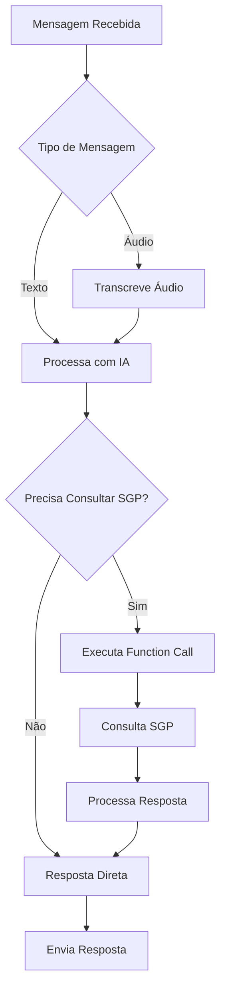
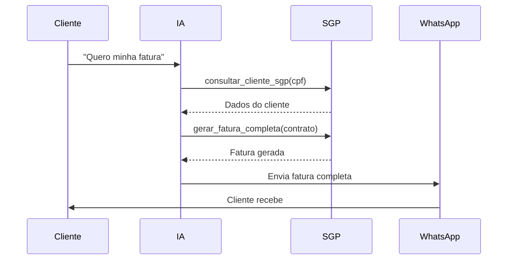

# Configuração da IA

O NioChat utiliza inteligência artificial avançada com ChatGPT para automatizar o atendimento via WhatsApp. Esta seção explica como configurar e personalizar a IA.

## 🎯 Funcionalidades da IA

### Atendimento Automatizado
- **Resposta Inteligente**: IA responde automaticamente às mensagens
- **Consulta SGP**: Busca dados reais do cliente automaticamente
- **Function Calls**: Executa ações no SGP em tempo real
- **Transcrição de Áudio**: Converte mensagens de voz em texto

### Personalização por Provedor
- **Personalidade Única**: Cada provedor configura sua própria IA
- **Estilo de Resposta**: Formal, informal, técnico, etc.
- **Uso de Emojis**: Configurável (sempre, ocasionalmente, nunca)
- **Saudações Dinâmicas**: Baseadas no horário atual

## 🚀 Configuração Inicial

### 1. Configurar OpenAI
1. Acesse [openai.com](https://openai.com)
2. Crie uma conta ou faça login
3. Vá em **API Keys**
4. Clique em **"Create new secret key"**
5. Copie a chave gerada

### 2. Configurar no Sistema
```bash
# .env
OPENAI_API_KEY=sk-sua_chave_openai_aqui
```

### 3. Testar Conexão
```bash
cd backend
python manage.py shell -c "
from core.openai_service import openai_service
print('Testando conexão OpenAI...')
result = openai_service.test_connection()
print(f'Resultado: {result}')
"
```

## 🔧 Configuração Avançada

### 1. Personalizar IA por Provedor
Acesse o admin Django e configure cada provedor:

#### Dados Básicos
- **Nome do Agente IA**: Nome que aparece nas respostas
- **Estilo de Personalidade**: Formal, informal, técnico, etc.
- **Uso de Emojis**: Sempre, ocasionalmente, nunca

#### Personalidade Avançada (Opcional)
```json
{
  "vicios_linguagem": ["né", "tipo assim", "então"],
  "caracteristicas": ["prestativo", "técnico", "amigável"],
  "principios": ["sempre ajudar o cliente", "ser transparente"],
  "humor": ["profissional", "descontraído"]
}
```

### 2. Configurar Transcrição de Áudio
```json
{
  "transcription_config": {
    "language": "pt-BR",
    "quality": "high",
    "delay_between": 1,
    "enable_double_transcription": true
  }
}
```

**Configurações disponíveis:**
- `language`: Idioma da transcrição ('pt-BR', 'en-US', 'es-ES')
- `quality`: Qualidade ('high', 'medium', 'low')
- `delay_between`: Delay entre transcrições (1-5 segundos)
- `enable_double_transcription`: Habilitar transcrição dupla

### 3. Configurar SGP por Provedor
```json
{
  "sgp_config": {
    "url": "https://sgp.provedor.com",
    "token": "token_de_acesso",
    "app": "niochat"
  }
}
```

## 🤖 Function Calls SGP

A IA executa automaticamente funções do SGP:

### 1. Consultar Cliente
```python
def consultar_cliente_sgp(cpf_cnpj):
    """
    Consulta dados do cliente no SGP
    Retorna: nome, contrato, status, etc.
    """
    pass
```

### 2. Verificar Acesso
```python
def verificar_acesso_sgp(contrato):
    """
    Verifica status da conexão do cliente
    Retorna: online, offline, suspenso
    """
    pass
```

### 3. Gerar Fatura
```python
def gerar_fatura_completa(contrato):
    """
    Gera fatura com PIX e Boleto
    Retorna: valor, vencimento, PIX, PDF
    """
    pass
```

### 4. Criar Chamado Técnico
```python
def criar_chamado_tecnico(cpf_cnpj, motivo, sintomas):
    """
    Cria chamado técnico e transfere para suporte
    Retorna: número do chamado
    """
    pass
```

## 📝 Exemplos de Uso

### 1. Consulta de Fatura
```
Cliente: "Quero pagar minha fatura"
IA: "Para gerar sua fatura, preciso do seu CPF."
Cliente: "123.456.789-00"
IA: [Executa consultar_cliente_sgp]
IA: "Encontrei seu cadastro!
     👤 Nome: João Silva
     📋 Contrato: 12345
     ✅ Status: Ativo
     
     🧾 **Sua Fatura**
     💵 Valor: R$ 89,90
     📅 Vencimento: 15/08/2024
     💳 PIX: abc123def
     📱 QR Code: [link]
     📄 PDF: [link]"
```

### 2. Suporte Técnico
```
Cliente: "Minha internet não funciona"
IA: "Para verificar sua conexão, preciso do seu CPF."
Cliente: "123.456.789-00"
IA: [Executa verificar_acesso_sgp]
IA: "Encontrei seu cadastro!
     👤 Nome: João Silva
     📋 Contrato: 12345
     
     🔍 **Status da Conexão**
     🌐 Status: Offline
     ⚠️ Problema detectado na sua região
     
     Já acionei nossa equipe técnica!"
```

### 3. Diagnóstico Inteligente
```
Cliente: "Estou sem internet"
IA: [Executa verificar_acesso_sgp automaticamente]
IA: "Vejo que sua conexão está offline. Você consegue ver algum LED vermelho piscando no seu modem?"

Cliente: "Sim, tem um LED vermelho piscando"
IA: [Executa criar_chamado_tecnico]
IA: "✅ Chamado técnico criado! Transferindo você para nossa equipe de suporte técnico..."
```

## 🔍 Fluxo de Processamento

### 1. Recebimento de Mensagem


### 2. Function Calls Automáticas


## 🎨 Personalização da IA

### 1. Estilo de Resposta
```json
{
  "estilo": "formal",
  "emojis": "ocasionalmente",
  "personalidade": {
    "vicios_linguagem": ["né", "tipo assim"],
    "caracteristicas": ["prestativo", "técnico"],
    "principios": ["sempre ajudar"],
    "humor": "profissional"
  }
}
```

### 2. Saudações Dinâmicas
```python
def get_greeting():
    hour = datetime.now().hour
    if 6 <= hour < 12:
        return "Bom dia"
    elif 12 <= hour < 18:
        return "Boa tarde"
    else:
        return "Boa noite"
```

### 3. Mensagens Personalizadas
```python
def get_custom_message(provedor):
    return f"""
    {get_greeting()}! Sou a {provedor.ia_agent_name} da {provedor.name}.
    Como posso ajudá-lo hoje?
    """
```

## 🔧 Configuração Técnica

### 1. Configurar OpenAI Service
```python
# backend/core/openai_service.py
class OpenAIService:
    def __init__(self):
        self.client = OpenAI(api_key=settings.OPENAI_API_KEY)
        self.model = "gpt-4"
    
    def process_message(self, message, conversation, provedor):
        # Processa mensagem com IA
        pass
    
    def transcribe_audio(self, audio_url, language="pt-BR"):
        # Transcreve áudio
        pass
```

### 2. Configurar Function Calls
```python
def get_function_definitions():
    return [
        {
            "name": "consultar_cliente_sgp",
            "description": "Consulta dados do cliente no SGP",
            "parameters": {
                "type": "object",
                "properties": {
                    "cpf_cnpj": {"type": "string", "description": "CPF ou CNPJ do cliente"}
                },
                "required": ["cpf_cnpj"]
            }
        }
    ]
```

### 3. Configurar Transcrição
```python
def transcribe_audio_double(audio_url, config):
    # Primeira transcrição
    transcription1 = transcribe_audio(audio_url, config['language'])
    
    # Delay configurável
    time.sleep(config['delay_between'])
    
    # Segunda transcrição
    transcription2 = transcribe_audio(audio_url, config['language'])
    
    # Retorna a melhor transcrição
    return choose_best_transcription(transcription1, transcription2)
```

## 🐛 Troubleshooting

### Problemas Comuns

#### Erro: "OpenAI API key not found"
```bash
# Verifique a variável de ambiente
echo $OPENAI_API_KEY

# Verifique se está no .env
grep OPENAI_API_KEY .env
```

#### Erro: "Function call failed"
```bash
# Verifique as credenciais do SGP
# Verifique se o SGP está acessível
curl -H "Authorization: Bearer $SGP_TOKEN" $SGP_URL/health
```

#### IA não responde
```bash
# Verifique os logs
tail -f logs/backend.log | grep "OpenAI"

# Teste a conexão
python manage.py shell -c "
from core.openai_service import openai_service
print(openai_service.test_connection())
"
```

#### Transcrição não funciona
```bash
# Verifique se o FFmpeg está instalado
ffmpeg -version

# Verifique as configurações de transcrição
python manage.py shell -c "
from core.models import Provedor
p = Provedor.objects.first()
print(p.integracoes_externas.get('transcription_config', {}))
"
```

## 📚 Próximos Passos

1. [:octicons-arrow-right-24: Function Calls](ai/function-calls.md) - Configure as funções SGP
2. [:octicons-arrow-right-24: SGP Integration](ai/sgp-integration.md) - Configure a integração SGP
3. [:octicons-arrow-right-24: Transcrição](ai/transcription.md) - Configure a transcrição de áudio
4. [:octicons-arrow-right-24: Uso](usage/chat.md) - Aprenda a usar o chat

