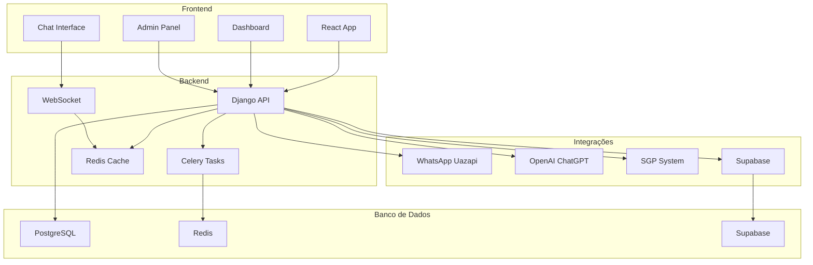

# Arquitetura do Sistema

O NioChat foi projetado com uma arquitetura moderna e escalável, utilizando as melhores práticas de desenvolvimento.

## Visão Geral da Arquitetura



## Componentes Principais

### 1. Frontend (React)
- **Responsabilidade**: Interface do usuário
- **Tecnologia**: React 18 + Vite
- **Características**: SPA, tempo real, responsivo
- **Comunicação**: REST API + WebSocket

### 2. Backend (Django)
- **Responsabilidade**: Lógica de negócio e API
- **Tecnologia**: Django 5.2 + DRF
- **Características**: RESTful, WebSocket, autenticação
- **Comunicação**: HTTP/WebSocket

### 3. Processamento Assíncrono (Celery)
- **Responsabilidade**: Tarefas em background
- **Tecnologia**: Celery + Redis
- **Características**: Escalável, confiável
- **Uso**: CSAT, notificações, processamento

### 4. Cache (Redis)
- **Responsabilidade**: Cache e sessões
- **Tecnologia**: Redis
- **Características**: Alta performance, persistente
- **Uso**: Sessões, cache, filas

### 5. Banco de Dados (PostgreSQL)
- **Responsabilidade**: Dados principais
- **Tecnologia**: PostgreSQL
- **Características**: ACID, escalável
- **Uso**: Dados transacionais

### 6. Dashboard (Supabase)
- **Responsabilidade**: Métricas e relatórios
- **Tecnologia**: Supabase
- **Características**: Tempo real, isolamento
- **Uso**: Dashboard, auditoria, CSAT

## Fluxo de Dados

### 1. Recebimento de Mensagem
```
WhatsApp → Uazapi → Webhook → Django → IA → Resposta
```

### 2. Processamento com IA
```
Mensagem → OpenAI → Function Calls → SGP → Dados → Resposta
```

### 3. Dashboard em Tempo Real
```
Evento → Supabase → WebSocket → Frontend → Atualização
```

### 4. Sistema CSAT
```
Fechamento → Celery → 1.5min → Envio → Feedback → IA → Análise
```

## Padrões Arquiteturais

### 1. Multi-Tenant
- **Isolamento**: Cada provedor tem seus dados
- **Segurança**: Row Level Security (RLS)
- **Escalabilidade**: Horizontal e vertical
- **Manutenção**: Independente por provedor

### 2. Event-Driven
- **Eventos**: Mensagens, conversas, CSAT
- **Processamento**: Assíncrono com Celery
- **Notificações**: Tempo real via WebSocket
- **Auditoria**: Log de todos os eventos

### 3. Microserviços
- **Separação**: Frontend, Backend, IA, SGP
- **Comunicação**: APIs REST e WebSocket
- **Deploy**: Independente
- **Escalabilidade**: Por componente

### 4. CQRS (Command Query Responsibility Segregation)
- **Commands**: Operações de escrita
- **Queries**: Consultas de leitura
- **Separação**: Dados transacionais vs. analíticos
- **Performance**: Otimizada para cada tipo

## Segurança

### 1. Autenticação
- **Método**: Token-based authentication
- **Segurança**: JWT com expiração
- **Renovação**: Automática
- **Logout**: Invalidação de token

### 2. Autorização
- **Níveis**: Superuser, Admin, Agent, Viewer
- **Permissões**: Granulares por recurso
- **Contexto**: Por provedor
- **Auditoria**: Log de todas as ações

### 3. Isolamento de Dados
- **RLS**: Row Level Security no Supabase
- **Filtros**: Automáticos por provedor
- **Vazamento**: Impossível entre provedores
- **Compliance**: LGPD e GDPR

### 4. Criptografia
- **Transmissão**: HTTPS/TLS
- **Armazenamento**: Dados sensíveis criptografados
- **Chaves**: Rotação automática
- **Backup**: Criptografado

## Performance

### 1. Cache Strategy
- **Redis**: Sessões e cache
- **CDN**: Arquivos estáticos
- **Database**: Índices otimizados
- **API**: Rate limiting

### 2. Escalabilidade
- **Horizontal**: Múltiplas instâncias
- **Vertical**: Recursos adicionais
- **Load Balancing**: Distribuição de carga
- **Auto-scaling**: Baseado em métricas

### 3. Monitoramento
- **Métricas**: Performance em tempo real
- **Alertas**: Notificações automáticas
- **Logs**: Centralizados
- **Dashboards**: Visualização

## Integrações

### 1. WhatsApp (Uazapi)
- **Protocolo**: Webhook
- **Formato**: JSON
- **Segurança**: Assinatura digital
- **Retry**: Automático

### 2. OpenAI
- **Protocolo**: HTTPS
- **Formato**: JSON
- **Rate Limiting**: Configurável
- **Fallback**: Resposta padrão

### 3. SGP
- **Protocolo**: HTTPS
- **Formato**: JSON/XML
- **Cache**: Dados temporários
- **Timeout**: Configurável

### 4. Supabase
- **Protocolo**: HTTPS
- **Formato**: JSON
- **Real-time**: WebSocket
- **RLS**: Row Level Security

## Deploy e Infraestrutura

### 1. Desenvolvimento
- **Local**: Docker Compose
- **Hot Reload**: Automático
- **Debug**: Logs detalhados
- **Testing**: Unit e integration

### 2. Produção
- **Servidor**: Ubuntu/CentOS
- **Proxy**: Nginx
- **SSL**: Let's Encrypt
- **Monitoring**: Systemd

### 3. CI/CD
- **GitHub Actions**: Automático
- **Testing**: Automático
- **Deploy**: Automático
- **Rollback**: Automático

## Monitoramento e Observabilidade

### 1. Métricas
- **Sistema**: CPU, RAM, Disco
- **Aplicação**: Requests, erros, latência
- **Negócio**: Conversas, CSAT, resolução
- **Custom**: Métricas específicas

### 2. Logs
- **Aplicação**: Django, Celery
- **Sistema**: Nginx, PostgreSQL
- **Integrações**: APIs externas
- **Auditoria**: Todas as ações

### 3. Alertas
- **Sistema**: Recursos baixos
- **Aplicação**: Erros altos
- **Negócio**: CSAT baixo
- **Integração**: APIs fora

## Próximos Passos

1. [Funcionalidades](features.md) - Explore todas as funcionalidades
2. [Instalação](../installation/development.md) - Configure o ambiente
3. [API](../api/endpoints.md) - Explore a API
4. [Configuração](../configuration/supabase.md) - Configure integrações