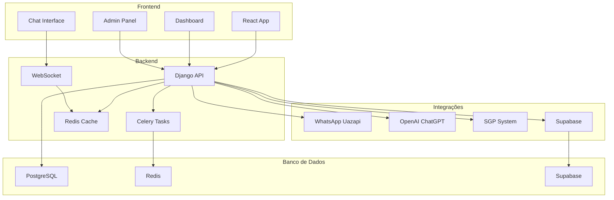

# NioChat - Sistema de Atendimento WhatsApp

<div class="grid cards" markdown>

-   :material-robot:{ .lg .middle } **IA Inteligente**

    ---

    Sistema de IA avançado com ChatGPT integrado, transcrição automática de áudio e consulta automática ao SGP

    [:octicons-arrow-right-24: Configurar IA](ai/configuration.md)

-   :material-whatsapp:{ .lg .middle } **WhatsApp**

    ---

    Integração completa com Uazapi/Evolution API para envio e recebimento de mensagens

    [:octicons-arrow-right-24: Configurar WhatsApp](configuration/integrations.md)

-   :material-database:{ .lg .middle } **Supabase**

    ---

    Dashboard em tempo real, auditoria avançada e sistema CSAT com Supabase

    [:octicons-arrow-right-24: Configurar Supabase](supabase/integration.md)

-   :material-chart-line:{ .lg .middle } **Dashboard**

    ---

    Métricas em tempo real, gráficos interativos e relatórios detalhados

    [:octicons-arrow-right-24: Ver Dashboard](usage/dashboard.md)

</div>

## 🚀 Funcionalidades Principais

### 🤖 Inteligência Artificial Avançada
- **IA ChatGPT Integrada**: Atendimento automatizado inteligente
- **Transcrição de Áudio**: Conversão automática de mensagens de voz para texto
- **Consulta SGP Automática**: IA consulta dados reais do cliente automaticamente
- **Function Calls**: IA executa funções do SGP em tempo real
- **Análise de Sentimento**: IA analisa feedback textual e converte em avaliações CSAT

### 📱 Integração WhatsApp Completa
- **Uazapi/Evolution API**: Integração nativa com WhatsApp Business
- **Webhooks em Tempo Real**: Recebimento instantâneo de mensagens
- **Mídia Completa**: Suporte a imagens, vídeos, áudios e documentos
- **Reações e Exclusão**: Sistema completo de interações
- **Status de Entrega**: Confirmação de recebimento das mensagens

### 📊 Dashboard e Métricas
- **Tempo Real**: Atualizações instantâneas via WebSocket
- **Métricas Avançadas**: Taxa de resolução, satisfação média, tempo de resposta
- **Gráficos Interativos**: Visualizações dinâmicas com Recharts
- **Filtros Avançados**: Por data, usuário, equipe e provedor
- **Exportação**: Relatórios em PDF e Excel

### 🔐 Sistema Multi-Tenant
- **Isolamento Total**: Cada provedor tem seus dados separados
- **Permissões Granulares**: Controle fino de acesso por usuário
- **Equipes**: Organização por equipes com visibilidade controlada
- **Transferência Inteligente**: Entre agentes e equipes

### 📈 Sistema CSAT
- **Coleta Automática**: Feedback enviado automaticamente após fechamento
- **Análise IA**: Interpretação automática de feedback textual
- **Dashboard Completo**: Métricas e evolução temporal
- **Histórico Detalhado**: Últimos feedbacks com fotos de perfil

## 🏗️ Arquitetura



## 🚀 Início Rápido

### 1. Clone o Repositório
```bash
git clone https://github.com/juniorssilvaa/niochat.git
cd niochat
```

### 2. Configure o Ambiente
```bash
# Backend
cd backend
python -m venv venv
source venv/bin/activate
pip install -r requirements.txt
python manage.py migrate
python manage.py createsuperuser

# Frontend
cd frontend/frontend
npm install
```

### 3. Inicie os Serviços
```bash
# Terminal 1 - Backend
cd backend
python manage.py runserver 0.0.0.0:8010

# Terminal 2 - Frontend
cd frontend/frontend
npm run dev
```

### 4. Acesse o Sistema
- **Frontend**: http://localhost:5173
- **Backend**: http://localhost:8010
- **Admin**: http://localhost:8010/admin

## 📚 Documentação Completa

Explore nossa documentação completa para aprender sobre:

- [:octicons-book-24: Instalação e Configuração](installation/development.md)
- [:octicons-code-24: API e Endpoints](api/endpoints.md)
- [:octicons-cpu-24: IA e SGP](ai/configuration.md)
- [:octicons-database-24: Supabase](supabase/integration.md)
- [:octicons-gear-24: Desenvolvimento](development/structure.md)

## 🆘 Suporte

- **GitHub Issues**: [Reportar problemas](https://github.com/juniorssilvaa/niochat/issues)
- **Documentação**: Navegue pelas seções acima
- **Email**: Entre em contato para suporte técnico

## 📄 Licença

Este projeto está sob a licença MIT. Veja o arquivo [LICENSE](https://github.com/juniorssilvaa/niochat/blob/main/LICENSE) para mais detalhes.
