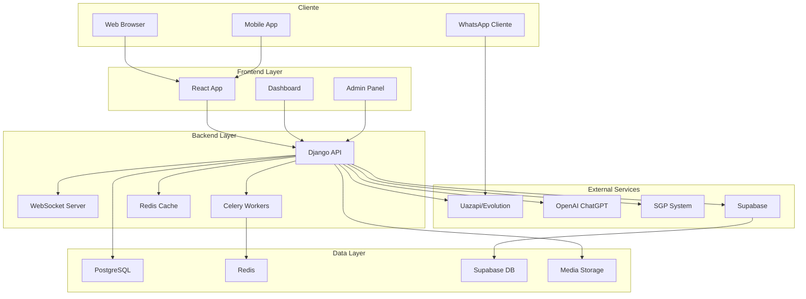
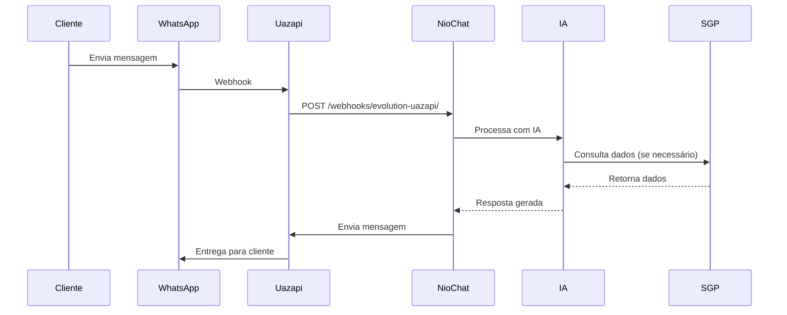
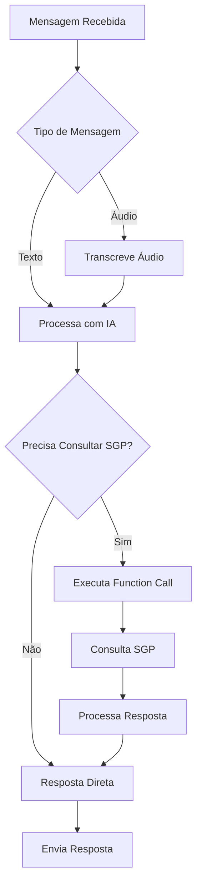
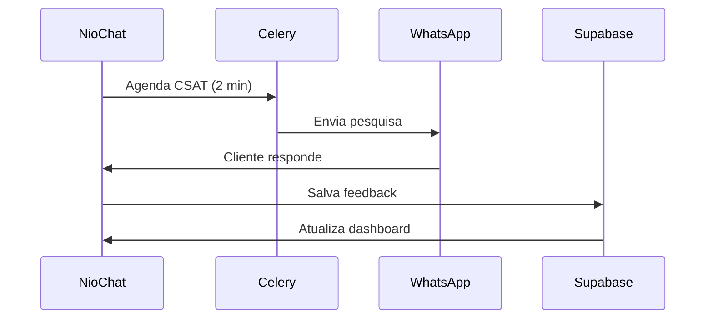
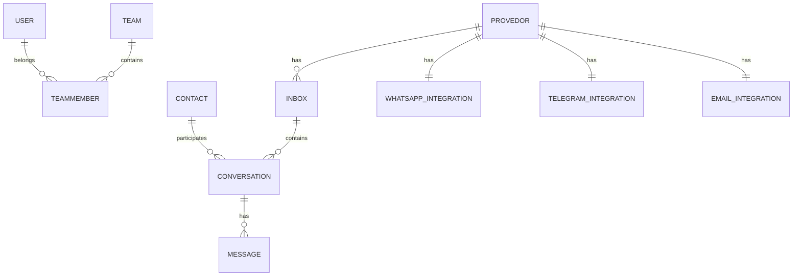

# Arquitetura do Sistema

O NioChat foi projetado com uma arquitetura moderna, escalável e robusta que combina múltiplas tecnologias para oferecer uma experiência completa de atendimento via WhatsApp.

## 🏗️ Visão Geral da Arquitetura



## 🔧 Componentes Principais

### Frontend (React)
- **Interface de Usuário**: Chat moderno e responsivo
- **Dashboard**: Métricas e relatórios em tempo real
- **Painel Admin**: Gestão de usuários e configurações
- **WebSocket Client**: Comunicação em tempo real

### Backend (Django)
- **API REST**: Endpoints para todas as operações
- **WebSocket Server**: Comunicação bidirecional
- **Celery Tasks**: Processamento assíncrono
- **Redis Cache**: Sessões e cache

### Integrações Externas
- **Uazapi/Evolution**: WhatsApp Business API
- **OpenAI ChatGPT**: IA conversacional
- **SGP**: Sistema de gestão de provedores
- **Supabase**: Dashboard e auditoria

## 📊 Fluxo de Dados

### 1. Recebimento de Mensagem


### 2. Processamento de IA


### 3. Sistema CSAT


## 🗄️ Estrutura de Dados

### Modelos Principais

#### Core (Sistema Principal)
```python
# Usuários e Empresas
User -> Company (M:N)
Company -> Provedor (1:N)
Provedor -> Canal (1:N)

# Auditoria
AuditLog -> User (N:1)
AuditLog -> Provedor (N:1)
```

#### Conversations (Conversas)
```python
# Estrutura de Conversas
Provedor -> Inbox (1:N)
Inbox -> Conversation (1:N)
Contact -> Conversation (1:N)
Conversation -> Message (1:N)

# Equipes
Team -> TeamMember (1:N)
User -> TeamMember (1:N)
```

#### Integrations (Integrações)
```python
# Integrações por Provedor
Provedor -> WhatsAppIntegration (1:1)
Provedor -> TelegramIntegration (1:1)
Provedor -> EmailIntegration (1:1)
```

### Relacionamentos Principais



## 🔄 Processamento Assíncrono

### Celery Tasks
- **CSAT Automation**: Envio automático de pesquisas
- **Media Processing**: Conversão de formatos
- **SGP Integration**: Consultas externas
- **Audit Logging**: Registro de ações

### Redis Cache
- **Sessões de Usuário**: Autenticação
- **Cache de Dados**: Consultas frequentes
- **WebSocket Channels**: Comunicação em tempo real
- **Task Queue**: Fila de processamento

## 🌐 Comunicação em Tempo Real

### WebSocket Events
```javascript
// Eventos do Chat
chat_message          // Nova mensagem
message_reaction      // Reação a mensagem
message_deleted       // Mensagem deletada
user_status          // Status do usuário
conversation_update  // Atualização de conversa

// Eventos do Dashboard
dashboard_metrics    // Métricas atualizadas
csat_update         // CSAT atualizado
audit_log          // Novo log de auditoria
```

### Channels Routing
```python
# backend/conversations/routing.py
websocket_urlpatterns = [
    path('ws/dashboard/', DashboardConsumer.as_asgi()),
    path('ws/chat/<int:conversation_id>/', ChatConsumer.as_asgi()),
    path('ws/internal-chat/', InternalChatConsumer.as_asgi()),
]
```

## 🔐 Segurança e Isolamento

### Multi-tenant Architecture
- **Isolamento de Dados**: Cada provedor tem seus dados separados
- **Permissões Granulares**: Controle fino de acesso
- **Row Level Security**: Supabase com RLS habilitado
- **API Authentication**: Token-based authentication

### Segurança de Dados
- **Criptografia**: Dados sensíveis criptografados
- **Auditoria**: Log completo de todas as ações
- **Backup**: Backup automático do banco
- **SSL/TLS**: Comunicação criptografada

## 📈 Escalabilidade

### Horizontal Scaling
- **Load Balancer**: Distribuição de carga
- **Multiple Workers**: Celery workers distribuídos
- **Database Sharding**: Particionamento por provedor
- **CDN**: Distribuição de mídia

### Vertical Scaling
- **Resource Optimization**: Uso eficiente de recursos
- **Caching Strategy**: Cache inteligente
- **Database Indexing**: Índices otimizados
- **Query Optimization**: Consultas otimizadas

## 🔧 Monitoramento

### Logs e Métricas
- **Application Logs**: Django logging
- **Performance Metrics**: Tempo de resposta
- **Error Tracking**: Rastreamento de erros
- **Health Checks**: Verificação de saúde

### Alertas
- **System Alerts**: Alertas do sistema
- **Performance Alerts**: Alertas de performance
- **Error Alerts**: Alertas de erro
- **Security Alerts**: Alertas de segurança

## 🚀 Deploy e DevOps

### CI/CD Pipeline
- **GitHub Actions**: Deploy automático
- **Testing**: Testes automatizados
- **Code Quality**: Análise de código
- **Security Scanning**: Verificação de segurança

### Containerização
- **Docker**: Containerização da aplicação
- **Docker Compose**: Orquestração local
- **Kubernetes**: Orquestração em produção
- **Health Checks**: Verificação de saúde

## 📚 Próximos Passos

1. [:octicons-arrow-right-24: Instalação](installation/development.md) - Configure o ambiente
2. [:octicons-arrow-right-24: Configuração](configuration/environment.md) - Configure variáveis
3. [:octicons-arrow-right-24: Integrações](configuration/integrations.md) - Configure serviços externos
4. [:octicons-arrow-right-24: Uso](usage/interface.md) - Aprenda a usar o sistema
