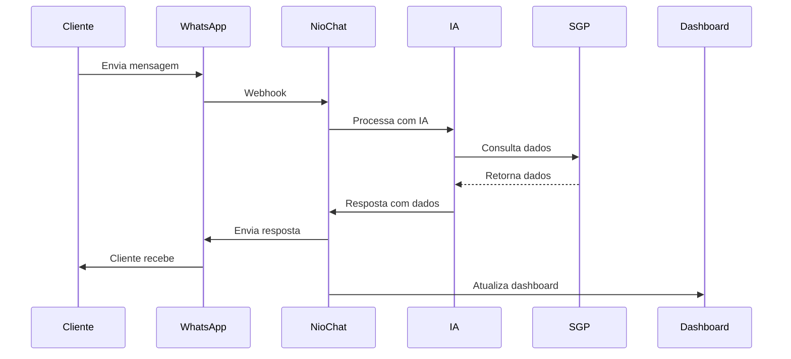

# Introdução

O **NioChat** é um sistema completo de atendimento via WhatsApp que combina inteligência artificial avançada, integração com sistemas de gestão (SGP) e dashboard em tempo real com Supabase.

## 🎯 Objetivo

O NioChat foi desenvolvido para automatizar e otimizar o atendimento ao cliente via WhatsApp, oferecendo:

- **Atendimento 24/7**: IA inteligente que responde automaticamente
- **Integração Total**: Consulta dados reais do cliente via SGP
- **Dashboard Avançado**: Métricas e relatórios em tempo real
- **Sistema CSAT**: Coleta automática de feedback de satisfação
- **Multi-tenant**: Suporte a múltiplos provedores isolados

## 🏢 Casos de Uso

### Provedores de Internet
- **Consulta de Faturas**: Cliente pede fatura → IA consulta SGP → gera PIX/Boleto automaticamente
- **Suporte Técnico**: Cliente relata problema → IA verifica status → cria chamado se necessário
- **Verificação de Status**: Cliente pergunta sobre conexão → IA consulta status real

### Empresas de Serviços
- **Atendimento Automatizado**: IA responde perguntas comuns
- **Agendamento**: Integração com sistemas de agendamento
- **Feedback**: Coleta automática de satisfação

## 🔧 Tecnologias Principais

### Backend
- **Django 5.2**: Framework web robusto
- **Django REST Framework**: API REST completa
- **Channels**: WebSocket para tempo real
- **Celery**: Processamento assíncrono
- **Redis**: Cache e sessões
- **PostgreSQL**: Banco de dados principal

### Frontend
- **React 18**: Interface moderna
- **Vite**: Build tool rápido
- **Tailwind CSS**: Estilização
- **Shadcn/ui**: Componentes UI
- **WebSocket**: Comunicação em tempo real

### Integrações
- **Uazapi/Evolution API**: WhatsApp Business
- **OpenAI ChatGPT**: IA conversacional
- **Supabase**: Dashboard e auditoria
- **SGP**: Sistema de gestão de provedores

## 🌟 Diferenciais

### 1. IA Inteligente
- **Não faz perguntas desnecessárias**: Se cliente diz "fatura", pede CPF direto
- **Consulta dados reais**: Nunca inventa informações
- **Function Calls**: Executa ações no SGP automaticamente
- **Transcrição de áudio**: Converte voz em texto automaticamente

### 2. Dashboard Avançado
- **Tempo real**: Atualizações instantâneas
- **Métricas precisas**: Dados reais do Supabase
- **Filtros avançados**: Por data, usuário, equipe
- **Exportação**: Relatórios em PDF/Excel

### 3. Sistema CSAT
- **Coleta automática**: Enviado 2 minutos após fechamento
- **Análise IA**: Interpreta feedback textual
- **Dashboard completo**: Métricas e evolução
- **Histórico detalhado**: Com fotos de perfil

### 4. Multi-tenant
- **Isolamento total**: Cada provedor tem seus dados
- **Configurações personalizadas**: IA, SGP, integrações
- **Permissões granulares**: Controle fino de acesso
- **Equipes**: Organização por equipes

## 📊 Fluxo de Atendimento

## 🎯 Benefícios

### Para o Cliente
- **Resposta Instantânea**: IA responde 24/7
- **Dados Reais**: Sempre informações corretas
- **Múltiplos Formatos**: PIX, Boleto, QR Code
- **Suporte Completo**: Desde consulta até suporte técnico

### Para a Empresa
- **Redução de Custos**: Menos atendentes humanos
- **Aumento de Produtividade**: Atendimento automatizado
- **Métricas Precisas**: Dashboard em tempo real
- **Feedback Automático**: CSAT sem intervenção manual

### Para os Agentes
- **Interface Moderna**: Chat intuitivo e responsivo
- **Filtros Inteligentes**: Conversas organizadas por status
- **Transferência Fácil**: Entre agentes e equipes
- **Histórico Completo**: Todas as mensagens e ações

## 🚀 Próximos Passos

1. [:octicons-arrow-right-24: Instalação](installation/development.md) - Configure o ambiente
2. [:octicons-arrow-right-24: Configuração](configuration/environment.md) - Configure variáveis
3. [:octicons-arrow-right-24: Integrações](configuration/integrations.md) - Configure WhatsApp e IA
4. [:octicons-arrow-right-24: Uso](usage/interface.md) - Aprenda a usar o sistema
